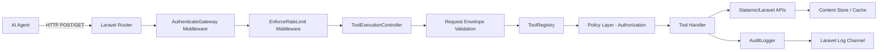
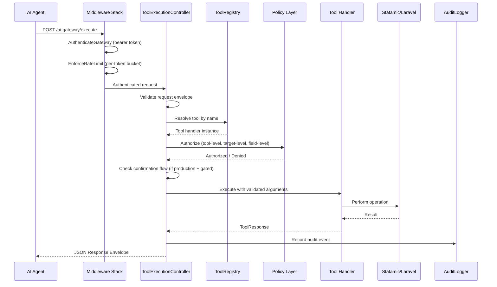

# AI Gateway

A safe, structured interface between AI agents and your Statamic application.

---

## Table of Contents

- [Overview](#overview)
- [Why This Addon Exists](#why-this-addon-exists)
- [Core Philosophy](#core-philosophy)
- [Architecture](#architecture)
  - [Key Design Decisions](#key-design-decisions)
  - [High-Level Architecture](#high-level-architecture)
  - [Request Pipeline](#request-pipeline)
  - [Module Structure](#module-structure)
  - [How the Pipeline Works](#how-the-pipeline-works)
- [Installation](#installation)
- [Enabling the Addon](#enabling-the-addon)
  - [How the Kill Switch Works](#how-the-kill-switch-works)
- [Control Panel Settings](#control-panel-settings)
  - [Accessing the Settings Panel](#accessing-the-settings-panel)
  - [What You Can Configure](#what-you-can-configure)
  - [How Settings Persistence Works](#how-settings-persistence-works)
  - [Configuration Precedence](#configuration-precedence)
- [Endpoints](#endpoints)
- [Configuration Reference](#configuration-reference)
  - [Full Configuration File](#full-configuration-file)
  - [Environment Variables](#environment-variables)
- [Security Model](#security-model)
  - [Three Layers of Authorization](#three-layers-of-authorization)
  - [Authentication](#authentication)
  - [Rate Limiting](#rate-limiting)
  - [Production Safety](#production-safety)
  - [Request Size Limit](#request-size-limit)
- [Confirmation Flow](#confirmation-flow)
  - [How It Works](#how-it-works)
  - [Token Implementation](#token-implementation)
- [Audit Logging](#audit-logging)
  - [What Gets Logged](#what-gets-logged)
  - [What Never Gets Logged](#what-never-gets-logged)
- [Tool Reference](#tool-reference)
  - [Content Tools](#content-tools)
  - [Asset Tools](#asset-tools)
  - [Blueprint Tools](#blueprint-tools)
  - [Metadata & Discovery Tools](#metadata--discovery-tools)
  - [Form Tools](#form-tools)
  - [User Management Tools](#user-management-tools)
  - [Custom Commands](#custom-commands)
  - [System & Cache Tools](#system--cache-tools)
- [Request / Response Contract](#request--response-contract)
  - [Request Envelope](#request-envelope)
  - [Success Response](#success-response)
  - [Error Response](#error-response)
  - [Confirmation Required Response](#confirmation-required-response)
  - [Error Codes](#error-codes)
  - [Exception Mapping](#exception-mapping)
- [Capability Discovery](#capability-discovery)
- [Internal Components](#internal-components)
  - [GatewayTool Interface](#gatewaytool-interface)
  - [ToolRegistry](#toolregistry)
  - [ToolPolicy](#toolpolicy)
  - [FieldFilter](#fieldfilter)
  - [ToolResponse](#toolresponse)
- [Testing](#testing)
  - [Property-Based Tests (Eris)](#property-based-tests-eris)
  - [Unit Tests](#unit-tests)
  - [Integration Tests](#integration-tests)
  - [Running Tests](#running-tests)
- [Extending with Custom Tools](#extending-with-custom-tools)
- [When Should You Use This?](#when-should-you-use-this)
- [When This Might Not Be For You](#when-this-might-not-be-for-you)
- [Minimal Setup Example](#minimal-setup-example)
- [Agent Setup Guide](#agent-setup-guide)
  - [1. Install the Skill](#1-install-the-skill)
  - [2. Prepare Each Site](#2-prepare-each-site)
  - [3. Configure the Agent](#3-configure-the-agent)
  - [4. Discover Capabilities Per Site](#4-discover-capabilities-per-site)
  - [5. Multi-Site Operation Tips](#5-multi-site-operation-tips)
  - [6. Verifying the Connection](#6-verifying-the-connection)
- [Future Direction](#future-direction)

---

## Overview

AI Gateway is a Statamic v6 addon (`stokoe/ai-gateway`) that provides a controlled, authenticated HTTP tool execution interface for AI agents. The addon acts as a gateway layer between external AI systems and your Statamic/Laravel application, mediating all AI-initiated content mutations, queries, and operational actions through a strict pipeline of authentication, validation, authorization, tool resolution, execution, and audit logging.

Rather than exposing your application directly, this addon introduces a **tool-based execution layer** with 41 tools across 15 capability areas. AI agents can request actions such as creating and searching content, managing assets and blueprints, reading form submissions, managing users, executing custom commands, and clearing caches — and the addon decides whether, how, and when those actions are allowed to happen.

This makes it possible to bring AI-assisted workflows into Statamic without compromising stability, security, or developer control.

---

## Why This Addon Exists

AI integrations are powerful — but they can also be dangerous if given unrestricted access.

Most approaches fall into one of two categories:

- **Direct access** to application internals (risky, hard to control)
- **Large tool surfaces** with many granular actions (complex, error-prone)

This addon takes a different approach:

> **A small, well-defined set of safe actions, enforced by strict rules.**

Instead of asking "what *can* the AI do?", this addon answers:

> **"What is the AI allowed to do safely?"**

---

## Core Philosophy

### 1. Controlled access, not full access

Your agent does not get direct access to your application. Instead, it interacts through **named tools**, each with explicit inputs, strict validation rules, and clear boundaries.

### 2. Safe by default

Everything is locked down unless you explicitly allow it. Tools must be enabled. Targets must be allowlisted. Fields can be restricted. Risky operations can require confirmation. If something isn't explicitly allowed, it doesn't happen.

### 3. Designed for production

This is not just a development tool — it's built to run safely in real environments. That means structured request/response contracts, predictable error handling, rate limiting, audit logging via Laravel's logging system, and confirmation flows for sensitive operations.

### 4. Fewer, smarter tools

Instead of exposing dozens of granular operations, this addon provides a small set of high-level actions. For example, `entry.upsert` instead of separate create/update flows, and `cache.clear` instead of multiple low-level commands. This makes it easier for agents to choose the right action, avoid mistakes, and behave predictably.

### 5. Framework-native execution

All actions are executed using Statamic and Laravel APIs, not direct file or system manipulation. This ensures compatibility with your existing setup, respect for blueprints and content structure, and consistency with how your application normally behaves.

---

## Architecture

### Key Design Decisions

1. **In-process addon over separate service** — Direct access to Statamic APIs, simpler deployment, no cross-service auth sync needed.
2. **Tool gateway pattern** — Named tools with structured arguments rather than generic remote access. Each capability is intentionally added.
3. **Configuration-driven allowlisting** — Default-deny posture where every tool, target, and field must be explicitly permitted.
4. **Synchronous execution only (v1)** — Simpler mental model, immediate feedback, appropriate for expected operation volume.
5. **Stateless confirmation tokens** — HMAC-signed tokens for production confirmation flow, avoiding database persistence.
6. **Single execution endpoint** — All tools invoked through one route, keeping the API contract minimal and consistent.

### High-Level Architecture



### Request Pipeline



### Module Structure

```
addons/stokoe/ai-gateway/
├── src/
│   ├── ServiceProvider.php
│   ├── Http/
│   │   ├── Controllers/
│   │   │   ├── ToolExecutionController.php
│   │   │   └── SettingsController.php
│   │   └── Middleware/
│   │       ├── AuthenticateGateway.php
│   │       └── EnforceRateLimit.php
│   ├── Tools/
│   │   ├── Contracts/
│   │   │   └── GatewayTool.php
│   │   ├── EntryCreateTool.php        EntryGetTool.php
│   │   ├── EntryUpdateTool.php        EntryListTool.php
│   │   ├── EntryUpsertTool.php        EntryDeleteTool.php
│   │   ├── EntrySearchTool.php        EntryPublishTool.php
│   │   ├── EntryUnpublishTool.php
│   │   ├── GlobalGetTool.php          GlobalUpdateTool.php
│   │   ├── NavigationGetTool.php      NavigationUpdateTool.php
│   │   ├── NavigationListTool.php
│   │   ├── TermGetTool.php            TermListTool.php
│   │   ├── TermUpsertTool.php         TermDeleteTool.php
│   │   ├── AssetUploadTool.php        AssetListTool.php
│   │   ├── AssetGetTool.php           AssetDeleteTool.php
│   │   ├── AssetMoveTool.php
│   │   ├── BlueprintGetTool.php       BlueprintCreateTool.php
│   │   ├── BlueprintUpdateTool.php    BlueprintDeleteTool.php
│   │   ├── CollectionListTool.php
│   │   ├── FormGetTool.php            FormListTool.php
│   │   ├── FormSubmissionsTool.php
│   │   ├── TaxonomyListTool.php       TaxonomyGetTool.php
│   │   ├── SiteListTool.php           SystemInfoTool.php
│   │   ├── UserListTool.php           UserGetTool.php
│   │   ├── UserCreateTool.php         UserUpdateTool.php
│   │   ├── UserDeleteTool.php
│   │   ├── CustomCommandTool.php
│   │   ├── CacheClearTool.php
│   │   ├── StacheWarmTool.php         StaticWarmTool.php
│   ├── Support/
│   │   ├── ToolRegistry.php
│   │   ├── ToolResponse.php
│   │   ├── ConfirmationTokenManager.php
│   │   ├── AuditLogger.php
│   │   ├── FieldFilter.php
│   │   └── SettingsRepository.php
│   ├── Policies/
│   │   └── ToolPolicy.php
│   └── Exceptions/
│       ├── ToolNotFoundException.php
│       ├── ToolDisabledException.php
│       ├── ToolAuthorizationException.php
│       └── ToolValidationException.php
├── config/
│   └── ai_gateway.php
├── routes/
│   └── api.php
└── tests/
    ├── TestCase.php
    ├── Property/          (26 property-based tests)
    ├── Unit/              (addon lifecycle tests)
    └── Integration/       (full pipeline tests)
```

### How the Pipeline Works

At a high level:

1. Your agent sends a JSON request describing what it wants to do
2. The `AuthenticateGateway` middleware validates the bearer token using `hash_equals()` for timing-safe comparison
3. The `EnforceRateLimit` middleware checks per-token rate limits
4. The `ToolExecutionController` validates the request envelope (content type, size, schema)
5. The `ToolRegistry` resolves the tool name to a handler class
6. The `ToolPolicy` checks tool-level authorization (is the tool enabled?) and target-level authorization (is the target in the allowlist?)
7. The `FieldFilter` strips any denied fields from the payload
8. The `ConfirmationTokenManager` checks whether confirmation is required (production safety)
9. Tool-specific validation runs against the handler's declared rules
10. The tool executes through Statamic/Laravel APIs
11. The `AuditLogger` records the operation
12. A structured JSON response is returned

All of this happens through a single, consistent interface.

---

## Installation

The addon is installed as a local package at `addons/stokoe/ai-gateway/`. To publish the configuration file:

```bash
php artisan vendor:publish --tag=ai-gateway-config
```

This copies `ai_gateway.php` into your application's `config/` directory, where you can customise it.

---

## Enabling the Addon

The addon is **disabled by default**. When disabled, it registers no routes, no bindings — it is completely invisible. Requests to `/ai-gateway/*` return Laravel's standard 404, leaking no information about the addon's existence.

Add to your `.env`:

```env
AI_GATEWAY_ENABLED=true
AI_GATEWAY_TOKEN=your-secret-token-here
```

`AI_GATEWAY_TOKEN` is the bearer token that all requests must include. Generate a strong, random string — this is your only authentication layer. The token is compared using `hash_equals()` to prevent timing attacks.

### How the Kill Switch Works

The `ServiceProvider` merges config in `register()`, then checks `ai_gateway.enabled` in `bootAddon()`. When disabled, it returns immediately — no routes are loaded, no singletons are bound. The addon is architecturally invisible.

```php
public function bootAddon(): void
{
    if (! config('ai_gateway.enabled')) {
        return;
    }
    // ... routes, singletons, publishable config
}
```

---

## Control Panel Settings

The addon includes a full settings panel in the Statamic Control Panel, so you can configure everything from the browser without touching `.env` files or config files.

### Accessing the Settings Panel

Once the addon is installed, an "AI Gateway" item appears in the CP sidebar under Tools. Click it to open the settings page. The panel is available even when the gateway API is disabled — you need to be able to turn it on from somewhere.

Only super admins can access the settings panel. Regular CP users won't see the nav item, and direct URL access returns a 403.

### What You Can Configure

The settings panel covers every configuration option:

- **General** — Master enable/disable toggle and bearer token management (masked display, reveal, and one-click generation of cryptographically random 64-character hex tokens)
- **Rate Limits** — Requests per minute for the execute and capabilities endpoints
- **Request Limits** — Maximum request body size in bytes
- **Tools** — Individual enable/disable toggles for all 41 tools, grouped by type (entry, global, navigation, term, cache, asset, blueprint, collection, form, site, user, system, custom command, taxonomy)
- **Allowlists** — Checkbox editors for collections, globals, navigations, taxonomies, asset containers, forms, and cache targets
- **User Management** — Master toggle for all user tools (`allowed_user_operations`)
- **Asset Upload Settings** — Max asset size and allowed file extensions
- **Custom Commands** — Add, edit, and remove custom artisan command definitions with alias, description, command string, and confirmation environments
- **Field Deny Lists** — Tag-input editors for entry, global, and term denied fields
- **Confirmation Flow** — Token TTL and per-tool environment rules for all destructive tools
- **Audit** — Log channel selection from your configured Laravel log channels

### How Settings Persistence Works

Settings are saved to a YAML file at `storage/statamic/addons/ai-gateway/settings.yaml`. This keeps them:

- Version-controllable (if you include storage in your repo)
- Consistent with Statamic's flat-file philosophy
- Independent of the database
- Portable across environments

The file is created automatically on first save. The `SettingsRepository` handles reading, writing, and directory creation.

### Configuration Precedence

The addon uses a layered configuration model:

1. **CP settings** (YAML file) — highest priority, wins when present
2. **Published config** (`config/ai_gateway.php`) — mid-level, used when no CP value exists
3. **Package defaults** (addon's built-in config with `.env` fallbacks) — lowest priority

This means:

- You can start with just `.env` variables and no CP configuration
- Once you save something in the CP, that value takes over
- `.env` values still work as fallbacks for anything you haven't configured in the CP
- Deleting the YAML file resets everything back to `.env`/config defaults

The merge happens at boot time via `SettingsRepository::applyToConfig()`, which runs `array_replace_recursive()` to merge YAML values over config defaults. All existing `config('ai_gateway.*')` calls throughout the codebase continue to work without modification.

---

## Endpoints

Once enabled, two routes are available:

| Method | Path                                        | Purpose                              |
|--------|---------------------------------------------|--------------------------------------|
| POST   | `/ai-gateway/execute`                       | Execute a tool                       |
| GET    | `/ai-gateway/capabilities`                  | Discover available tools and config  |
| GET    | `/ai-gateway/capabilities/custom-commands`  | Discover custom command definitions  |
| GET    | `/ai-gateway/capabilities/{tool}`           | Get usage info for a specific tool   |

All require the `Authorization: Bearer <token>` header. All pass through `AuthenticateGateway` and `EnforceRateLimit` middleware.

---

## Configuration Reference

### Full Configuration File

The complete `config/ai_gateway.php`:

```php
return [
    // Master kill switch — addon is invisible when false
    'enabled' => env('AI_GATEWAY_ENABLED', false),

    // Bearer token for authentication
    'token' => env('AI_GATEWAY_TOKEN'),

    // Maximum request body size in bytes (default 64KB)
    'max_request_size' => env('AI_GATEWAY_MAX_REQUEST_SIZE', 65536),

    // Rate limits (requests per minute, per token)
    'rate_limits' => [
        'execute'      => env('AI_GATEWAY_RATE_LIMIT_EXECUTE', 30),
        'capabilities' => env('AI_GATEWAY_RATE_LIMIT_CAPABILITIES', 60),
    ],

    // Tool enablement — all disabled by default
    'tools' => [
        'entry'          => ['get', 'list', 'create', 'update', 'upsert', 'delete', 'search', 'publish', 'unpublish'],
        'global'         => ['get', 'update'],
        'navigation'     => ['get', 'update', 'list'],
        'term'           => ['get', 'list', 'upsert', 'delete'],
        'cache'          => ['clear'],
        'stache'         => ['warm'],
        'static'         => ['warm'],
        'asset'          => ['upload', 'list', 'get', 'delete', 'move'],
        'blueprint'      => ['get', 'create', 'update', 'delete'],
        'collection'     => ['list'],
        'form'           => ['get', 'list', 'submissions'],
        'site'           => ['list'],
        'custom_command'  => ['execute'],
        'taxonomy'       => ['list', 'get'],
        'user'           => ['list', 'get', 'create', 'update', 'delete'],
        'system'         => ['info'],
    ],

    // Target allowlists — empty by default (nothing permitted)
    'allowed_collections'       => [],
    'allowed_globals'           => [],
    'allowed_navigations'       => [],
    'allowed_taxonomies'        => [],
    'allowed_cache_targets'     => [],
    'allowed_asset_containers'  => [],
    'allowed_forms'             => [],
    'allowed_custom_commands'   => [],

    // User management — toggle-based (not per-resource allowlist)
    'allowed_user_operations' => false,

    // Asset upload constraints
    'max_asset_size' => env('AI_GATEWAY_MAX_ASSET_SIZE', 10485760), // 10MB
    'allowed_asset_extensions' => [
        'jpg', 'jpeg', 'png', 'gif', 'webp', 'svg',
        'pdf', 'doc', 'docx', 'xls', 'xlsx', 'csv',
        'txt', 'md', 'mp4', 'webm', 'mp3',
    ],

    // Field-level deny lists per target type
    'denied_fields' => [
        'entry'  => [],
        'global' => [],
        'term'   => [],
    ],

    // Confirmation flow
    'confirmation' => [
        'ttl'   => env('AI_GATEWAY_CONFIRMATION_TTL', 60),
        'tools' => [
            'cache'     => ['clear' => ['production']],
            'entry'     => ['delete' => ['production'], 'unpublish' => ['production']],
            'term'      => ['delete' => ['production']],
            'asset'     => ['upload' => ['production'], 'delete' => ['production'], 'move' => ['production']],
            'blueprint' => ['delete' => ['production']],
            'user'      => ['create' => ['production'], 'delete' => ['production']],
        ],
    ],

    // Audit logging
    'audit' => [
        'channel' => env('AI_GATEWAY_LOG_CHANNEL', null),
    ],

    // Custom commands (populated via CP settings)
    'custom_commands' => [],
];
```

### Environment Variables

| Variable                            | Default  | Description                                    |
|-------------------------------------|----------|------------------------------------------------|
| `AI_GATEWAY_ENABLED`               | `false`  | Master kill switch                             |
| `AI_GATEWAY_TOKEN`                 | `null`   | Bearer token for authentication                |
| `AI_GATEWAY_MAX_REQUEST_SIZE`      | `65536`  | Max request body in bytes                      |
| `AI_GATEWAY_RATE_LIMIT_EXECUTE`    | `30`     | Requests/min for execute endpoint              |
| `AI_GATEWAY_RATE_LIMIT_CAPABILITIES`| `60`    | Requests/min for capabilities endpoint         |
| `AI_GATEWAY_MAX_ASSET_SIZE`        | `10485760` | Max asset upload size in bytes (10MB)        |
| `AI_GATEWAY_CONFIRMATION_TTL`     | `60`     | Confirmation token lifetime in seconds         |
| `AI_GATEWAY_LOG_CHANNEL`          | `null`   | Laravel log channel for audit (null = default) |

Every tool has a corresponding `AI_GATEWAY_TOOL_{GROUP}_{ACTION}` env variable (e.g. `AI_GATEWAY_TOOL_ENTRY_CREATE`, `AI_GATEWAY_TOOL_ASSET_UPLOAD`), all defaulting to `false`.

---

## Security Model

### Three Layers of Authorization

The addon enforces a **default-deny** security model with three layers:

**Layer 1 — Tool-level:** Each tool must be explicitly enabled in config. A disabled tool returns `403 tool_disabled`.

**Layer 2 — Target-level:** Even with a tool enabled, it can only operate on explicitly allowed targets. The `ToolPolicy` maps each tool's target type to its corresponding allowlist:

| Tool target type  | Config key                             | Notes                                    |
|-------------------|----------------------------------------|------------------------------------------|
| `entry`           | `ai_gateway.allowed_collections`       |                                          |
| `global`          | `ai_gateway.allowed_globals`           |                                          |
| `navigation`      | `ai_gateway.allowed_navigations`       |                                          |
| `taxonomy`        | `ai_gateway.allowed_taxonomies`        |                                          |
| `cache`           | `ai_gateway.allowed_cache_targets`     |                                          |
| `asset`           | `ai_gateway.allowed_asset_containers`  |                                          |
| `form`            | `ai_gateway.allowed_forms`             |                                          |
| `custom_command`  | `ai_gateway.allowed_custom_commands`   |                                          |
| `user`            | `ai_gateway.allowed_user_operations`   | Boolean toggle, not per-resource list    |
| `site`            | —                                      | No allowlist (all sites returned)        |
| `system`          | —                                      | No allowlist (tool-level toggle only)    |
| `blueprint`       | Delegates to resource-type allowlist   | Checks collection/global/taxonomy list   |

A request targeting something not in the allowlist returns `403 forbidden`.

**Layer 3 — Field-level:** Even within allowed targets, specific fields can be denied:

```php
'denied_fields' => [
    'entry'  => ['slug', 'date', 'author', 'blueprint'],
    'global' => ['site_secret_key'],
    'term'   => [],
],
```

Denied fields are silently stripped from the `data` payload before the tool executes. The caller is not notified — the fields simply don't get written. This happens after target-level authorization and before tool execution.

### Authentication

All requests require an `Authorization: Bearer <token>` header. The `AuthenticateGateway` middleware:

- Rejects missing headers → `401 unauthorized`
- Rejects malformed headers (not `Bearer <token>`) → `401 unauthorized`
- Compares tokens using `hash_equals()` for timing-safe comparison → `401 unauthorized` on mismatch
- Loads the expected token from `config('ai_gateway.token')`, never from hardcoded values

### Rate Limiting

The `EnforceRateLimit` middleware uses Laravel's `RateLimiter` facade with per-token buckets:

- Execute endpoint: `ai_gateway.rate_limits.execute` (default 30/min)
- Capabilities endpoint: `ai_gateway.rate_limits.capabilities` (default 60/min)
- Rate limit key is derived from a SHA-256 hash of the bearer token
- Exceeding the limit returns `429 rate_limited`

### Production Safety

In production (`APP_ENV=production`):

- Stack traces and filesystem paths are never included in error responses
- Exception class names are not exposed
- The `error.message` for `internal_error` is generic: "An internal error occurred"
- Full exception details are written to the audit log for operator diagnosis
- The `cache.clear` tool requires a two-step confirmation flow by default

### Request Size Limit

The maximum request body size defaults to 64KB:

```env
AI_GATEWAY_MAX_REQUEST_SIZE=65536
```

Oversized requests are rejected with `422 validation_failed` before any processing occurs.

---

## Confirmation Flow

Sensitive operations can require a two-step confirmation in specific environments. By default, several destructive tools require confirmation in production:

```php
'confirmation' => [
    'ttl'   => env('AI_GATEWAY_CONFIRMATION_TTL', 60),
    'tools' => [
        'cache'     => ['clear' => ['production']],
        'entry'     => ['delete' => ['production'], 'unpublish' => ['production']],
        'term'      => ['delete' => ['production']],
        'asset'     => ['upload' => ['production'], 'delete' => ['production'], 'move' => ['production']],
        'blueprint' => ['delete' => ['production']],
        'user'      => ['create' => ['production'], 'delete' => ['production']],
    ],
],
```

Custom commands can also define per-command confirmation environments.

### How It Works

1. Agent calls a confirmation-gated tool without a token
2. The addon returns `confirmation_required` with a signed, short-lived token
3. Agent resends the exact same request with the `confirmation_token` field
4. The addon validates the token and executes the tool

First request → receives token:
```json
{
    "ok": false,
    "error": { "code": "confirmation_required", "message": "This operation requires explicit confirmation in production." },
    "confirmation": {
        "token": "base64-encoded-hmac-token",
        "expires_at": "2026-04-14T12:05:00+00:00",
        "operation_summary": { "tool": "cache.clear", "target": "static", "environment": "production" }
    },
    "meta": {}
}
```

Second request → include the token:
```json
{
    "tool": "cache.clear",
    "arguments": { "target": "static" },
    "confirmation_token": "base64-encoded-hmac-token"
}
```

### Token Implementation

Tokens are generated by the `ConfirmationTokenManager` using HMAC-SHA256:

- **Signing input:** `tool_name | canonical_arguments_json | timestamp`
- **Signing key:** Laravel's `APP_KEY`
- **Token format:** `base64(timestamp.signature)`
- **Expiry:** Checked by extracting the embedded timestamp — no database required
- **Binding:** Tokens are bound to the exact tool + arguments they were issued for. A token for `cache.clear` with `target: "static"` will not validate for `target: "stache"`

This prevents:
- Accidental destructive actions
- One-step execution of sensitive operations
- Token reuse across different operations
- Unintended automation loops

---

## Audit Logging

Every request to the execute endpoint is logged — including rejected requests. Logs go through Laravel's logging system.

```env
AI_GATEWAY_LOG_CHANNEL=stack
```

Set to `null` (default) to use your application's default log channel.

### What Gets Logged

Each log entry (written as `ai_gateway.audit` via `Log::info()`) includes:

| Field               | Description                                    |
|---------------------|------------------------------------------------|
| `request_id`        | Client-provided tracking ID (if any)           |
| `idempotency_key`   | Client-provided dedup key (if any)             |
| `tool`              | Tool name that was invoked                     |
| `status`            | `succeeded`, `failed`, or `rejected`           |
| `http_status`       | HTTP status code of the response               |
| `target_type`       | `entry`, `global`, `navigation`, `taxonomy`, `cache`, `asset`, `form`, `user`, `site`, `system`, `blueprint`, `custom_command` |
| `target_identifier` | The specific target (e.g. collection handle)   |
| `environment`       | Application environment                        |
| `duration_ms`       | Request processing time in milliseconds        |
| `error_code`        | Error code (when applicable)                   |

### What Never Gets Logged

The `AuditLogger` explicitly strips these sensitive keys:

- Bearer tokens / authorization headers
- Confirmation tokens
- Raw request payloads
- Passwords and secrets

---

## Tool Reference

The addon provides 41 tools across 15 groups. All tools are disabled by default and must be explicitly enabled.

### Content Tools

#### `entry.create`

Creates a new entry in a collection. Returns `409 conflict` if the entry already exists.

```json
{
    "tool": "entry.create",
    "arguments": {
        "collection": "pages",
        "slug": "hello-world",
        "site": "default",
        "published": true,
        "data": { "title": "Hello World", "content": "Welcome to our site." }
    }
}
```

| Argument     | Required | Type    | Default     | Notes                                  |
|-------------|----------|---------|-------------|----------------------------------------|
| `collection` | yes      | string  |             | Must be in `allowed_collections`       |
| `slug`       | yes      | string  |             | Unique within collection + site        |
| `data`       | yes      | object  |             | Field values; validated against blueprint |
| `published`  | no       | boolean |             | Publish state of the entry             |
| `site`       | no       | string  | `"default"` | For multi-site setups                  |

#### `entry.update`

Updates an existing entry. Merges the provided `data` onto the existing entry — only the fields you send are changed. Returns `404 resource_not_found` if the entry doesn't exist. Same arguments as `entry.create`.

#### `entry.upsert`

Creates the entry if it doesn't exist, updates it if it does. Returns `status: "created"` or `status: "updated"`. Same arguments as `entry.create`. This is the safest choice for most content operations.

#### `entry.get`

Retrieves a single entry by collection, slug, and optional site. Returns the entry's ID, slug, published state, and data fields (with denied fields stripped).

#### `entry.list`

Lists entries in a collection with pagination. Supports `limit` (1–100, default 25) and `offset` (min 0, default 0).

#### `entry.delete`

Deletes an entry from a collection. Confirmation-gated in production by default.

```json
{
    "tool": "entry.delete",
    "arguments": { "collection": "pages", "slug": "old-page", "site": "default" }
}
```

#### `entry.search`

Searches entries by field values or title substring.

```json
{
    "tool": "entry.search",
    "arguments": {
        "collection": "articles",
        "filter": { "author": "John", "category": "news" },
        "query": "search term",
        "limit": 25,
        "offset": 0,
        "site": "default"
    }
}
```

| Argument     | Required | Type    | Default     | Notes                                      |
|-------------|----------|---------|-------------|---------------------------------------------|
| `collection` | yes      | string  |             | Must be in `allowed_collections`            |
| `filter`     | no       | object  |             | Field-value pairs for exact matching        |
| `query`      | no       | string  |             | Case-insensitive title substring search     |
| `limit`      | no       | integer | `25`        | 1–100                                       |
| `offset`     | no       | integer | `0`         | Min 0                                       |
| `site`       | no       | string  | `"default"` | For multi-site setups                       |

#### `entry.publish` / `entry.unpublish`

Set an entry's published state to true or false as distinct editorial workflow actions, separate from data updates. `entry.unpublish` is confirmation-gated in production by default.

```json
{
    "tool": "entry.publish",
    "arguments": { "collection": "articles", "slug": "my-draft" }
}
```

#### `global.update`

Updates a global variable set's localized values for a given site.

```json
{
    "tool": "global.update",
    "arguments": {
        "handle": "contact_information",
        "site": "default",
        "data": { "phone": "555-0200", "email": "hello@example.com" }
    }
}
```

#### `navigation.update`

Replaces an entire navigation tree. This is a full replacement — the existing tree is discarded.

```json
{
    "tool": "navigation.update",
    "arguments": {
        "handle": "main_navigation",
        "site": "default",
        "tree": [
            { "url": "/", "title": "Home" },
            { "url": "/about", "title": "About" }
        ]
    }
}
```

#### `term.upsert`

Creates or updates a taxonomy term.

```json
{
    "tool": "term.upsert",
    "arguments": { "taxonomy": "tags", "slug": "laravel", "data": { "title": "Laravel" } }
}
```

#### `term.delete`

Deletes a taxonomy term. Confirmation-gated in production by default.

```json
{
    "tool": "term.delete",
    "arguments": { "taxonomy": "tags", "slug": "old-tag" }
}
```

### Asset Tools

All asset tools use the `allowed_asset_containers` allowlist.

#### `asset.upload`

Uploads a base64-encoded file to an asset container. Validates file size against `max_asset_size` and extension against `allowed_asset_extensions`. Confirmation-gated in production.

```json
{
    "tool": "asset.upload",
    "arguments": {
        "container": "assets",
        "path": "images/hero.jpg",
        "file": "<base64-encoded-content>",
        "alt": "Hero image"
    }
}
```

| Argument    | Required | Type   | Notes                                          |
|------------|----------|--------|-------------------------------------------------|
| `container` | yes      | string | Must be in `allowed_asset_containers`           |
| `path`      | yes      | string | Destination path within the container           |
| `file`      | yes      | string | Base64-encoded file content                     |
| `alt`       | no       | string | Alt text for the asset                          |

#### `asset.list`

Lists assets in a container with optional path prefix filtering and pagination.

```json
{
    "tool": "asset.list",
    "arguments": { "container": "assets", "path": "images/", "limit": 25, "offset": 0 }
}
```

#### `asset.get`

Retrieves a single asset's metadata including ID, path, URL, size, last-modified, alt text, MIME type, and image dimensions (width/height) when the asset is an image.

```json
{
    "tool": "asset.get",
    "arguments": { "container": "assets", "path": "images/hero.jpg" }
}
```

#### `asset.delete`

Deletes an asset from a container. Confirmation-gated in production.

#### `asset.move`

Moves an asset within or between containers. Both source and destination containers are checked against the allowlist. Returns `409 conflict` if the destination already exists. Confirmation-gated in production.

```json
{
    "tool": "asset.move",
    "arguments": {
        "source_container": "assets",
        "source_path": "images/old-hero.jpg",
        "destination_path": "images/archive/old-hero.jpg",
        "destination_container": "archive"
    }
}
```

### Blueprint Tools

Blueprint tools accept a `resource_type` (`collection`, `global`, or `taxonomy`) and authorize against the corresponding resource-type allowlist (e.g. collection handle checked against `allowed_collections`).

#### `blueprint.get`

Retrieves the field schema of a blueprint with each field's handle, display name, type, validation rules, and required flag. Denied fields are stripped from the response.

```json
{
    "tool": "blueprint.get",
    "arguments": { "resource_type": "collection", "handle": "pages" }
}
```

#### `blueprint.create`

Creates a new blueprint. Field types are validated against Statamic's known fieldtypes.

```json
{
    "tool": "blueprint.create",
    "arguments": {
        "resource_type": "collection",
        "handle": "pages",
        "fields": [
            { "handle": "title", "type": "text", "display": "Title", "required": true },
            { "handle": "content", "type": "bard", "display": "Content" }
        ]
    }
}
```

#### `blueprint.update`

Merges or replaces field definitions in an existing blueprint. Existing fields with matching handles are replaced; new fields are appended.

#### `blueprint.delete`

Deletes a blueprint. Confirmation-gated in production.

### Metadata & Discovery Tools

#### `collection.list`

Lists collections in the `allowed_collections` allowlist with handle, title, route, structure config, and taxonomy handles. Supports an optional `handle` argument for single-collection metadata.

```json
{
    "tool": "collection.list",
    "arguments": {}
}
```

#### `taxonomy.list`

Lists taxonomies in the `allowed_taxonomies` allowlist with handle, title, and term count.

#### `taxonomy.get`

Retrieves a taxonomy's handle, title, route pattern, attached collection handles, and blueprint info.

#### `navigation.list`

Lists navigations in the `allowed_navigations` allowlist with handle, title, and max depth.

#### `site.list`

Returns all configured Statamic sites with handle, name, locale, and URL. No allowlist — all sites are returned. Read-only, no confirmation.

#### `system.info`

Returns Statamic version, Laravel version, PHP version, environment name, and addon version. No allowlist — tool-level toggle only. Read-only, no confirmation.

### Form Tools

All form tools use the `allowed_forms` allowlist.

#### `form.get`

Retrieves a form's handle, title, fields configuration, and submission count.

```json
{
    "tool": "form.get",
    "arguments": { "handle": "contact" }
}
```

#### `form.list`

Lists all forms in the `allowed_forms` allowlist with handle, title, and submission count.

#### `form.submissions`

Returns a paginated list of form submissions with ID, date, and field data. Supports `limit` (1–100, default 25) and `offset` (min 0, default 0).

### User Management Tools

All user tools are gated by the `allowed_user_operations` boolean toggle. When disabled, all user tools return `403 forbidden`.

#### `user.list`

Returns a paginated list of users with ID, name, email, roles, and super-admin status.

#### `user.get`

Retrieves a user by `id` or `email`. At least one must be provided.

```json
{
    "tool": "user.get",
    "arguments": { "email": "john@example.com" }
}
```

#### `user.create`

Creates a new user. Confirmation-gated in production.

```json
{
    "tool": "user.create",
    "arguments": {
        "email": "jane@example.com",
        "name": "Jane Doe",
        "password": "secure-password",
        "roles": ["editor"]
    }
}
```

#### `user.update`

Updates a user by `id` or `email`. Requires confirmation when the `password` field is present and the environment is in the confirmation list.

#### `user.delete`

Deletes a user by `id` or `email`. Confirmation-gated in production.

### Custom Commands

Operator-defined artisan commands that AI agents can discover and execute through the Gateway.

#### Defining Commands

Custom commands are defined in the CP settings panel. Each command has:
- **Alias** — kebab-case identifier (e.g. `rebuild-search`)
- **Description** — human-readable description
- **Command** — the artisan command string (e.g. `statamic:search:update --all`)
- **Confirmation environments** — optional list of environments requiring confirmation

Commands can also be defined in `settings.yaml`:

```yaml
custom_commands:
  - alias: "rebuild-search"
    description: "Rebuild the search index"
    command: "statamic:search:update --all"
    confirmation_environments: ["production"]
```

#### `custom_command.execute`

Executes a custom command by alias. Returns `resource_not_found` for unknown aliases, `execution_failed` for non-zero exit codes.

```json
{
    "tool": "custom_command.execute",
    "arguments": { "alias": "rebuild-search" }
}
```

#### Discovery Endpoint

`GET /ai-gateway/capabilities/custom-commands` returns all enabled custom command definitions with alias, description, and confirmation status.

### System & Cache Tools

#### `cache.clear`

Clears a specific cache target. Confirmation-gated in production by default.

```json
{
    "tool": "cache.clear",
    "arguments": { "target": "stache" }
}
```

| Target        | Artisan command                |
|---------------|--------------------------------|
| `application` | `cache:clear`                  |
| `static`      | `statamic:static:clear`        |
| `stache`      | `statamic:stache:clear`        |
| `glide`       | `statamic:glide:clear`         |

#### `stache.warm` / `static.warm`

Warms the Stache or static cache respectively.

---

## Request / Response Contract

### Request Envelope

Every request to `POST /ai-gateway/execute` uses the same envelope:

```json
{
    "tool": "entry.create",
    "arguments": { "collection": "pages", "slug": "test", "data": { "title": "Test" } },
    "request_id": "optional-tracking-id",
    "idempotency_key": "optional-dedup-key",
    "confirmation_token": "optional-if-confirming"
}
```

| Field                | Required | Type   | Description                                |
|----------------------|----------|--------|--------------------------------------------|
| `tool`               | yes      | string | Tool name to invoke                        |
| `arguments`          | yes      | object | Tool-specific arguments                    |
| `request_id`         | no       | string | Echoed back in `meta.request_id`           |
| `idempotency_key`    | no       | string | Included in audit log for dedup tracking   |
| `confirmation_token` | no       | string | Required when confirming a gated operation |

### Success Response

```json
{
    "ok": true,
    "tool": "entry.create",
    "result": {
        "status": "created",
        "target_type": "entry",
        "target": { "collection": "pages", "slug": "hello-world", "site": "default" }
    },
    "meta": { "request_id": "your-tracking-id" }
}
```

### Error Response

```json
{
    "ok": false,
    "tool": "entry.create",
    "error": {
        "code": "validation_failed",
        "message": "The title field is required.",
        "details": { "data.title": ["The title field is required."] }
    },
    "meta": { "request_id": "your-tracking-id" }
}
```

### Confirmation Required Response

```json
{
    "ok": false,
    "tool": "cache.clear",
    "error": { "code": "confirmation_required", "message": "This operation requires explicit confirmation in production." },
    "confirmation": {
        "token": "base64-encoded-token",
        "expires_at": "2026-04-14T12:05:00+00:00",
        "operation_summary": { "tool": "cache.clear", "target": "static", "environment": "production" }
    },
    "meta": {}
}
```

### Error Codes

| Code                   | HTTP | Meaning                                        |
|------------------------|------|------------------------------------------------|
| `unauthorized`         | 401  | Missing or invalid bearer token                |
| `forbidden`            | 403  | Target not in allowlist                        |
| `tool_not_found`       | 404  | Tool name not registered                       |
| `tool_disabled`        | 403  | Tool exists but is not enabled                 |
| `validation_failed`    | 422  | Bad request envelope or tool arguments         |
| `resource_not_found`   | 404  | Collection, entry, asset, user, etc. doesn't exist |
| `conflict`             | 409  | Resource already exists (create / asset move)  |
| `rate_limited`         | 429  | Too many requests                              |
| `confirmation_required`| 200  | Confirmation token issued, re-send to confirm  |
| `execution_failed`     | 500  | Tool or custom command execution failed        |
| `internal_error`       | 500  | Unhandled server error (production only)       |

### Exception Mapping

The `ToolExecutionController` catches all known exception types and maps them to response envelopes:

| Exception                    | HTTP | Error Code         |
|------------------------------|------|--------------------|
| `ToolNotFoundException`      | 404  | `tool_not_found`   |
| `ToolDisabledException`      | 403  | `tool_disabled`    |
| `ToolAuthorizationException` | 403  | `forbidden`        |
| `ToolValidationException`    | 422  | `validation_failed`|
| `\Throwable` (catch-all)    | 500  | `execution_failed` / `internal_error` |

No exceptions bubble up to Laravel's default exception handler for addon routes.

---

## Capability Discovery

Call `GET /ai-gateway/capabilities` to see what's available:

```json
{
    "ok": true,
    "tool": "capabilities",
    "result": {
        "capabilities": {
            "entry.create":          { "enabled": true,  "target_type": "entry",          "requires_confirmation": false },
            "entry.update":          { "enabled": true,  "target_type": "entry",          "requires_confirmation": false },
            "entry.upsert":          { "enabled": false, "target_type": "entry",          "requires_confirmation": false },
            "entry.delete":          { "enabled": false, "target_type": "entry",          "requires_confirmation": true  },
            "entry.search":          { "enabled": true,  "target_type": "entry",          "requires_confirmation": false },
            "entry.publish":         { "enabled": false, "target_type": "entry",          "requires_confirmation": false },
            "asset.upload":          { "enabled": true,  "target_type": "asset",          "requires_confirmation": true  },
            "asset.list":            { "enabled": true,  "target_type": "asset",          "requires_confirmation": false },
            "blueprint.get":         { "enabled": true,  "target_type": "blueprint",      "requires_confirmation": false },
            "collection.list":       { "enabled": true,  "target_type": "entry",          "requires_confirmation": false },
            "form.list":             { "enabled": false, "target_type": "form",           "requires_confirmation": false },
            "user.list":             { "enabled": false, "target_type": "user",           "requires_confirmation": false },
            "custom_command.execute": { "enabled": false, "target_type": "custom_command", "requires_confirmation": false },
            "system.info":           { "enabled": true,  "target_type": "system",         "requires_confirmation": false },
            "cache.clear":           { "enabled": true,  "target_type": "cache",          "requires_confirmation": true  }
        }
    },
    "meta": {}
}
```

This endpoint reads all 41 registered tools from the `ToolRegistry`, instantiates each handler, and returns its enabled status, target type, and whether it requires confirmation in the current environment.

For custom commands specifically, call `GET /ai-gateway/capabilities/custom-commands` to discover available command definitions with alias, description, and confirmation status.

---

## Internal Components

### GatewayTool Interface

Every tool implements `Stokoe\AiGateway\Tools\Contracts\GatewayTool`:

```php
interface GatewayTool
{
    public function name(): string;                              // e.g. 'entry.create'
    public function targetType(): string;                        // e.g. 'entry', 'global', 'cache'
    public function validationRules(): array;                    // Laravel validation rules
    public function resolveTarget(array $arguments): ?string;    // Extract target for authorization
    public function execute(array $arguments): ToolResponse;     // Perform the operation
    public function requiresConfirmation(string $environment): bool;
}
```

### ToolRegistry

Maps tool names to handler classes. Resolves tools via the Laravel container and checks enabled status from config:

- `resolve(string $name)` → returns `GatewayTool` instance, throws `ToolNotFoundException` or `ToolDisabledException`
- `isEnabled(string $name)` → checks `config("ai_gateway.tools.{$name}")`
- `all()` → returns metadata for all registered tools (used by capabilities endpoint)

### ToolPolicy

Centralized authorization:

- `toolEnabled(string $toolName)` → checks config
- `targetAllowed(string $targetType, string $target)` → checks the corresponding allowlist
- `deniedFields(string $targetType, ?string $target)` → returns the deny list for field filtering

### FieldFilter

Strips denied fields from data payloads:

```php
$filter->filter(['title' => 'Hello', 'author' => 'AI'], ['author']);
// Returns: ['title' => 'Hello']
```

Uses `array_diff_key()` for efficient filtering.

### ToolResponse

Value object for consistent response building with three static factories:

- `ToolResponse::success(string $tool, array $result, array $meta = [])`
- `ToolResponse::error(string $tool, string $code, string $message, int $httpStatus, array $meta = [], ?array $details = null)`
- `ToolResponse::confirmationRequired(string $tool, string $token, string $expiresAt, array $operationSummary, array $meta = [])`

All produce a `JsonResponse` via `toJsonResponse()` with the correct envelope structure.

---

## Testing

The addon has 178 tests with 23,600+ assertions across three categories:

### Property-Based Tests (Eris)

26 correctness properties validated with 100+ random iterations each:

1. **Token comparison correctness** — `hash_equals` returns true iff tokens match
2. **Request envelope validation** — accepts valid envelopes, rejects malformed ones
3. **Request ID round-trip** — `request_id` appears unchanged in response meta
4. **Tool registry resolution** — correct handler for registered+enabled, exceptions for others
5. **Allowlist enforcement** — targets in allowlist pass, all others denied
6. **Field filtering** — preserves allowed fields, removes denied fields
7. **Tool argument validation** — required fields, correct types, no unknown keys
8. **Confirmation token round-trip** — generate then validate succeeds immediately
9. **Confirmation token binding** — token for one (tool, args) pair fails for another
10. **Response envelope consistency** — success/error/confirmation all have correct structure
11. **Audit log completeness and safety** — required fields present, sensitive data absent
12. **Asset size validation** — oversized payloads rejected, within-limit payloads accepted
13. **Asset extension validation** — disallowed extensions rejected, case-insensitive matching
14. **Asset list prefix filtering** — path prefix returns only matching assets, excludes none
15. **Asset move dual-container auth** — both source and destination containers checked
16. **Blueprint allowlist delegation** — correct allowlist checked per resource type
17. **Blueprint fieldtype validation** — unrecognized fieldtypes rejected with listing
18. **List tools allowlist filtering** — only allowlisted resources returned, none excluded
19. **Entry search filter matching** — returned entries match all filter criteria
20. **Entry search query matching** — returned entries contain query as title substring
21. **Custom command dynamic confirmation** — confirmation iff environment in command's list
22. **Custom command alias validation** — kebab-case, non-empty, unique aliases enforced
23. **Custom command settings round-trip** — write/read preserves definitions
24. **Tool registry expansion** — all 41 registered tools resolve to GatewayTool instances
25. **User tools toggle gating** — all user tools gated by operations toggle
26. **User update password confirmation** — confirmation iff password present and environment in list

### Unit Tests

- Addon disabled → 404 on both endpoints
- Addon enabled → routes registered (401 without token, not 404)

### Integration Tests

Full HTTP pipeline tests covering:

- Authentication (missing/invalid/valid tokens, capabilities auth)
- Rate limiting (within limit, exceeding limit, separate buckets)
- Entry tools (create, duplicate conflict, update, upsert create/update paths, delete, search, publish/unpublish, disallowed collection, nonexistent collection, request_id round-trip)
- Global tools (update existing, nonexistent global)
- Navigation tools (update existing, nonexistent navigation)
- Term tools (upsert create, upsert update, delete, nonexistent taxonomy, non-allowlisted taxonomy)
- Cache tools (valid target, invalid target, disallowed target, confirmation flow, confirmation with valid token)
- Asset tools (upload, list, get, delete, move with container authorization)
- Blueprint tools (get, create, update, delete with resource-type delegation)
- Form tools (get, list, submissions)
- User tools (list, get, create, update, delete with toggle gating)
- Custom commands (execute, unknown alias, discovery endpoint)
- Capabilities endpoint (structure, tool listing, enabled status, target types, all 41 tools present)
- Settings controller (validation rules, resources endpoint with asset containers and forms)
- Audit logging (succeeded, failed, rejected events)

### Running Tests

```bash
cd addons/stokoe/ai-gateway
vendor/bin/phpunit
```

---

## Extending with Custom Tools

To add a new tool:

1. Create a class implementing `GatewayTool` in `src/Tools/`
2. Define `name()`, `targetType()`, `validationRules()`, `resolveTarget()`, `execute()`, `requiresConfirmation()`
3. Register it in `ToolRegistry::$tools`
4. Add a config entry in `ai_gateway.tools`
5. Add the corresponding allowlist config if needed

The tool automatically gets the full pipeline: authentication, rate limiting, envelope validation, authorization, field filtering, confirmation flow, audit logging.

---

## When Should You Use This?

This addon is a great fit if you want to:

- Integrate agentic content management into a Statamic project
- Automate content workflows safely
- Allow AI-assisted updates without giving away full control
- Build custom AI-powered tooling on top of Statamic
- Maintain strong operational and security boundaries

## When This Might Not Be For You

This addon is intentionally restrictive. It may not be the right fit if you want:

- Unrestricted programmatic control over your app
- Direct execution of arbitrary commands
- A large, exploratory tool surface for development experimentation
- AI acting with full system-level access

---

## Minimal Setup Example

For a site that needs AI-managed content in `pages` and `projects`, with asset management and cache clearing:

**.env:**
```env
AI_GATEWAY_ENABLED=true
AI_GATEWAY_TOKEN=sk_live_a1b2c3d4e5f6g7h8i9j0

AI_GATEWAY_TOOL_ENTRY_UPSERT=true
AI_GATEWAY_TOOL_ENTRY_SEARCH=true
AI_GATEWAY_TOOL_ASSET_UPLOAD=true
AI_GATEWAY_TOOL_ASSET_LIST=true
AI_GATEWAY_TOOL_BLUEPRINT_GET=true
AI_GATEWAY_TOOL_COLLECTION_LIST=true
AI_GATEWAY_TOOL_CACHE_CLEAR=true
AI_GATEWAY_TOOL_SYSTEM_INFO=true
```

**config/ai_gateway.php** (published):
```php
'allowed_collections' => ['pages', 'projects'],
'allowed_asset_containers' => ['assets'],
'allowed_cache_targets' => ['stache', 'static'],

'denied_fields' => [
    'entry' => ['author', 'blueprint'],
],
```

Eight tools, two collections, one asset container, two cache targets, two denied fields. Everything else stays locked down.

---

## Agent Setup Guide

This section walks through connecting an AI agent (such as OpenClaw) to one or more Statamic sites running the AI Gateway addon. The assumption is that you're managing multiple websites and want a single agent to operate across all of them.

### 1. Install the Skill

Install the AI Gateway skill from ClawHub so your agent knows how to interact with the endpoint:

```
clawhub install statamic-ai-gateway
```

The skill teaches your agent the request format, available tools, error handling, and confirmation flow. Without it, the agent won't know how to structure requests.

### 2. Prepare Each Site

On every Statamic site you want the agent to manage, you need three things: the addon enabled, a unique token, and the tools/targets configured.

Generate a unique, strong token for each site. Don't reuse tokens across sites — if one is compromised, you only need to rotate that one.

```bash
# Generate a random token (run once per site)
openssl rand -hex 32
```

Add to each site's `.env`:

```env
AI_GATEWAY_ENABLED=true
AI_GATEWAY_TOKEN=<the-token-you-generated>
```

Then publish and configure the allowlists for that site. Each site will likely have different collections, globals, and navigations — configure only what that specific site needs:

```bash
php artisan vendor:publish --tag=ai-gateway-config
```

### 3. Configure the Agent

Your agent needs to know about each site it manages. Set up a site registry — the exact format depends on your agent platform, but the information needed per site is:

| Field       | Example                              | Notes                                |
|-------------|--------------------------------------|--------------------------------------|
| Name        | `marketing-site`                     | Human-readable label                 |
| Base URL    | `https://marketing.example.com`      | The site's public URL                |
| Endpoint    | `https://marketing.example.com/ai-gateway/execute` | Always `{base_url}/ai-gateway/execute` |
| Token       | `a1b2c3d4e5f6...`                   | The `AI_GATEWAY_TOKEN` for this site |

For example, if you manage three sites:

```
┌─────────────────────┬──────────────────────────────────────────┬──────────────┐
│ Site                │ Endpoint                                 │ Token        │
├─────────────────────┼──────────────────────────────────────────┼──────────────┤
│ Marketing site      │ https://marketing.example.com/ai-gateway │ token-aaa... │
│ Documentation site  │ https://docs.example.com/ai-gateway      │ token-bbb... │
│ Client portal       │ https://portal.example.com/ai-gateway    │ token-ccc... │
└─────────────────────┴──────────────────────────────────────────┴──────────────┘
```

Each site is independent — its own token, its own allowlists, its own rate limits. The agent selects the right endpoint and token based on which site it's operating on.

### 4. Discover Capabilities Per Site

Before performing operations on a site, the agent should call the capabilities endpoint to learn what's available:

```
GET https://marketing.example.com/ai-gateway/capabilities
Authorization: Bearer token-aaa...
```

This returns which tools are enabled, what target types they operate on, and whether any require confirmation. The agent should cache this per site and refresh periodically — capabilities can change when a site operator updates their config.

Different sites will have different capabilities. The marketing site might allow `entry.upsert` on `pages` and `projects`, while the docs site only allows `entry.upsert` on `articles`. The agent should respect these boundaries and not assume one site's config applies to another.

### 5. Multi-Site Operation Tips

**Use unique `request_id` values.** Include the site name in your request IDs (e.g. `marketing-site:req_01abc`) so audit logs are easy to trace across sites.

**Handle errors per site.** A `403 forbidden` on one site doesn't mean the same target is forbidden on another. Always check the specific error and site context.

**Rate limits are per site.** Each site enforces its own rate limits independently. Hitting the limit on the marketing site doesn't affect your quota on the docs site.

**Prefer `entry.upsert` over `entry.create`.** When operating across multiple sites, upsert is more resilient — you don't need to track whether an entry already exists on each site.

**Rotate tokens independently.** If you need to rotate a token, update the `.env` on that specific site and the corresponding entry in your agent's site registry. Other sites are unaffected.

**Test in staging first.** Each site can have its own staging environment with the gateway enabled. Use separate tokens for staging vs production. The confirmation flow only activates in production by default, so staging operations execute immediately.

### 6. Verifying the Connection

Once a site is configured and the agent has its credentials, verify the connection:

```bash
# Check capabilities (should return 200 with tool list)
curl -s -H "Authorization: Bearer <token>" \
  https://your-site.com/ai-gateway/capabilities | jq .

# Test a simple operation (if entry.upsert is enabled)
curl -s -X POST \
  -H "Authorization: Bearer <token>" \
  -H "Content-Type: application/json" \
  -d '{"tool":"entry.upsert","arguments":{"collection":"pages","slug":"test","data":{"title":"Connection Test"}},"request_id":"setup-test"}' \
  https://your-site.com/ai-gateway/execute | jq .
```

If you get `401`, check the token. If you get `404`, the addon isn't enabled. If you get `403`, the tool or target isn't in the allowlist. The error codes are designed to tell you exactly what's wrong.

---

## Future Direction

The architecture is designed to grow safely over time. Potential future capabilities include:

- Dry-run and "explain" modes for safer planning
- More advanced audit and observability features
- Deeper integration with custom application logic
- Webhook notifications for tool executions
- Role-based access control with multiple tokens

All while maintaining the same core principle:

> **Controlled, explicit, and safe interaction between AI and your application.**
